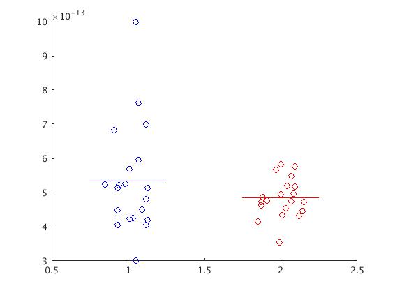

# Non-Parametric Cluster-Based Permutation Tests for Analysing Neural Time-Series tutorial

Statistical comparison and testing with MEG/EEG (and similar multidimensional neural time-series data) signals require considerable considerations on the design of the study and how to control for multiple comparisons. In this tutorial, we shall look at different approaches to comparing MEG/EEG signals from two conditions.

1. Analysis based on pre-specified data feature.
2. Non-parametric cluster-based permutation tests on a single channel.
3. Non-parametric cluster-based permutation tests on the full sensor-array.

You will do a group-level analysis from a within-subject experiment with two experimental conditions and N=20 subjects. The *unit of observation* is a single subject. You can find the data here: [LINK](https://www.dropbox.com/sh/ye51s8735ma2x8a/AAC9OjUBUSLgdombDuxifcYda?dl=0).

## Data and Hypothesis

The data simulates the evoked responses for an experiment where the subject received a tactile stimulation on the hand while under low attentional load (*data1*) or high attentional load (*data2*). At this stage, the data is already pre-processed (filtered, epoched, removed bad trials, etc.) and averaged across trials within-subject for each condition. The data is arranged so that the index of each dataset corresponds to the same subject, i.e., the first response in *data1* and *data2* both belong to subject #1, and so on.

The datafiles contain whole-head MEG data consisting of 102 magnetometers from a Neuromag Triux MEG system and EEG from 97 channels arranged in a standard 1010 montage.

## Hypothesis

The question we want to test if attentional load affect the primary somatosensory processing of the tactile stimulation?

**H1: Attentional load influence the primary somatosensory processing.**

**H0: The primary somatosensory processing is the same independent of attentional load.**

## Setup paths

The first step is to point to the path where we have the data and setup FieldTrip. Change these to appropriate paths for your operating system and setup.

````matlab
%% Add fieldtrip
addpath('~/fieldtrip/fieldtrip')
ft_defaults

%% Define path to data
data_path = '~/meeg_course/data';   % Change to match your data path          
cd(data_path)
````

## Load data
Load the data that contains the pre-processed single-trial data. For a group-level comparison, you would load the averaged data for each participant.

````matlab
%% Load data
load('d1.mat'); disp('done') 		% Data for condition 1
load('d2.mat'); disp('done') 		% Data for condition 2
````

The cell arrays `d1` and `d2` each contain the evoked (time-domain epoched and averaged data) for 20 subjects arranged in FieldTrip format.

### MEG or EEG

Note that there is both MEG and EEG data in the datasets. All examples below will use the MEG data. If you are up for the challenge,  you can change the code to do the tutorial on the EEG data instead. Every time you encounter example code where you specify the type of channel to do the operation on, e.g.:

````matlab
cfg.channel = 'megmag';
````

replace it with:

````matlab
cfg.channel = 'eeg';
````

For plotting EEG instead of MEG, change:

````matlab
cfg.layout = 'neuromag306mag.lay';
````

to

````matlab
cfg.layout = 'elec1010.lay';
````

## Inspect data

Take the time to explore the data a bit. Type `d1{1}` to see the content of the first dataset of condition 1.

If you are unfamiliar with FieldTrip, see if you can find 1) the sampling rate, 2) the start/stop time of the epoch, and 3) the actual M/EEG data?

Visualising data is a good way to inspect M/EEG data. Use `ft_multiplotER` to plot the ERFs/ERPs. The plots show the averaged responses for all sensors of the given type. The plots are interactive. Use your courser to select channels and then click on them to open a new figure that zooms in on the selected channels. You can then highlight parts of the time-series in the same way to open a new figure that shows the topography of that time window.  Use this to explore the evoked responses.

This code will plot all subjects' responses in a single figure per condition (can be slow):

````matlab
%% Plot MEG data
cfg = [];
cfg.layout = 'neuromag306mag.lay';
ft_multiplotER(cfg, d1{:}); title('Condition 1')   # Plot condition 1
ft_multiplotER(cfg, d2{:}); title('Condition 2')   # Plot condition 2
````


Next step, calculate the grand average for each condition:

````Matlab
%% Calculate the grand average
ga1 = ft_timelockgrandaverage([], d1{:});
ga2 = ft_timelockgrandaverage([], d2{:});
````

Plot the grand averages to compare

````matlab
%% Plot grand average
cfg = [];
cfg.layout = 'neuromag306mag.lay';
cfg.showcomment = 'no';
ft_multiplotER(cfg, ga1, ga2)
````


This is the data! The question you have to answer is if there is a systematic difference between the two conditions?

## Statistics on data feature

The first option to compare conditions is to select pre-specified features in the data. We might hypothesise that there is a difference between conditions in the amplitude of the evoked responses that occurs around 140-180 ms after stimulation. To test this hypothesis, we only need to select the amplitude of the evoked. The amplitude can be represented as a single scalar number per unit of observation. The comparison can therefore be made with a single paired t-test.

To compare the ERF component's amplitude between conditions, we first need to extract this value from the data. We find the channel that shows the largest effect in the time-window of interest and then take the average value within this time-window to compare between conditions (we could find the peak value within the data, but there are several reason why this is a bad idea).

The first step is to select our feature of interest for the two conditions. Ideally, we would select the data feature from a completely independent condition to avoid bias. In this step, we opt for the least bad solution and create a common average of the two conditions to create a synthetic "localiser" condition.

````matlab
%% Average condition 1 and 2
ga0 = ft_timelockgrandaverage([], d1{:}, d2{:});

%% Plot for inspection
cfg = [];
cfg.layout = 'neuromag306mag.lay';
ft_multiplotER(cfg, ga0) 			
# ft_multiplotER(cfg, ga0, ga1, ga2)  		# see all three grand averages side by side
````

Here we could manually look for the channel with the largest response, but this is a sub-optimal procedure for many reasons. Instead, we use the evoked response for the combined data to define the channel where we extract the peak value. We will find the magnetometer with the largest peak in the specified time-window (`t_win`) in the combined data.

````matlab
%% Find peak channel
t_win = [0.140 0.180];

% Select MEG data
cfg = [];
cfg.channel = 'megmag';
ga0 = ft_selectdata(cfg, ga0);

% Select windows
toi = ga0.time > t_win(1) & ga0.time < t_win(2);

% Find peak channel
[mx1, idx1] = max(mean(ga0.avg(:,toi),2));
pk_chan = ga0.label(idx1);
````

Where is the peak channel? Does it correspond to what you had expected from the plot above? 

We then use the name of the channel that we found (stores in `pk_chan`) to select data from the thumb and little finger data separately with `ft_selectdata`. In `ft_selectdata` we can also specify the time-window, and we can specify that we want to average data over the time-window.

````matlab
%% Select data
% Init new data structure  for single-channel data 
tmp_d1 = cell(size(d1));
tmp_d2 = cell(size(d2));

% Options for selecting data
cfg = [];
cfg.channel     = pk_chan;
cfg.latency     = t_win;
cfg.avgovertime = 'yes'; 		% Average over time-window

for ii = 1:20
    tmp_d1{ii} = ft_selectdata(cfg, d1{ii});
    tmp_d2{ii} = ft_selectdata(cfg, d2{ii});
end
````

Rearrange the values into two arrays for easy comparison:

````matlab
%% Arrange data
tmp_d1 = [tmp_d1{:}];
tmp_d2 = [tmp_d2{:}];

pk_d1 = [tmp_d1.avg];
pk_d2 = [tmp_d2.avg];
````

Before we do the test, look at the data that we are comparing. Use the MATLAB function `mean` and `std` to explore the mean and standard deviation. Visually inspect with a scatter plot:

````matlab
%% Scatter plots
figure;
scatter(ones(size(pk_d1)).*randi([85,115], 1,length(pk_d1))/100, pk_d1, 'b'); hold on
scatter(ones(size(pk_d2)).*randi([185,215], 1,length(pk_d1))/100, pk_d2, 'r')
line([0.75, 1.25], [mean(pk_d1), mean(pk_d1)], 'Color','b')
line([1.75, 2.25], [mean(pk_d2), mean(pk_d2)], 'Color','r')
xlim([0.5 2.5])
````



Finally, let us make the statistical comparison. Use MATLAB's built-in function for a paired t-test (``ttest``):

````matlab
%% T-test
[H, P, CI, t] = ttest(pk_d1, pk_d2)    # H: favourd hypothesis, P: p-value, CI: confidence interval, t: t-statistic
````

Explore the test result on your own. Did you find a difference?

### Intermediate summary

The *feature summary* approach to comparing MEG/EEG signals features, like what you have just done, is easy to apply and does not require more statistical knowledge than any other comparison between two measurements. This approach can have its advantages, but you have to be specific about the hypothesis that you want to test to guide what part of the MEG/EEG signal takes as the feature of interest.

The danger of this approach is that it opens for easy ways to cheat at statistics, either intentional or not. By first looking at your data and then selecting the feature that you want to compare based on how the data looks, you are already deciding on the difference before you do the statistical test. Implicitly, we then rely on our subjective visual inspection to make inference. This is double-dipping and is known as hypothesising after the results are known (aka *HARKing*) and is wrong! The features of the MEG/EEG signals that you compare should be defined in advance before you look at your data and even before you do the experiment (see [Kiler, 2013]( https://www.sciencedirect.com/science/article/pii/S1388245713002721?via%3Dihub)).

The localiser approach is an attempt to accommodate feature selection. Ideally, we would have an independent condition to determine the peak channel and time window of interest (or any other data feature in M/EEG data you want to investigate). The synthetic approach used above can be used as long as we can assume that the grand average of all conditions represents the unbiased middle-groups. But note that this is not necessarily the case depending on the type of task and data.

## Non-parametric cluster-based permutation tests on single-channel data

Non-parametric cluster-based permutation tests offer a way to analyse more than just a single feature of the data signals while at the same time correcting for multiple comparisons. The principles of non-parametric cluster-based permutation tests are, in short, that we test for differences across all time points (or frequency points, or whatever type of data that we test) and then take the sum data points that are connected. In this example, it will be time-points that are connected. The test is then repeated *N*-times where the data labels are randomly assigned. The cluster sum of the largest cluster in the real data is compared to the distribution of the largest cluster values for all permutation. If the largest cluster sum from the real partition of the data is higher than 95% of the distribution of the cluster sums from all permutations, we reject the null-hypothesis (for a detailed description see [Maris & Oostenveld, 2007](https://www.sciencedirect.com/science/article/pii/S0165027007001707)).

Now let us test for differences between the ERFs for the tactile stimulation between conditions.

We select the channel that showed the largest ERF peak (as above) as the region of interest.

````matlab
%% Select single-channel data
% Init new data structure for single-channel data
chan_d1 = cell(size(d1));
chan_d2 = cell(size(d2));

% Options for selecting data
cfg = [];
cfg.channel     = pk_chan;  		# Same channel as above
cfg.avgovertime = 'no'; 			# Do not average over time

for ii = 1:20
    chan_d1{ii} = ft_selectdata(cfg, d1{ii});
    chan_d2{ii} = ft_selectdata(cfg, d2{ii});
end
````

For good measure, let us inspect the ERFs before we proceed with the statistics.

````matlab
%% Calculate grand average
ga_d1 = ft_timelockgrandaverage([], chan_d1{:});
ga_d2 = ft_timelockgrandaverage([], chan_d2{:});

%% Plot grand averages
cfg = [];
cfg.channel = pk_chan;
cfg.showcomment = 'no';
ft_singleplotER(cfg, ga_d1, ga_d2)
````


To do the non-parametric cluster-based permutation test on evoked signals, we use the function `ft_timelockstatistics`. `ft_timelockstatistics` is a high-level function that are used to do the different types of statistical test implemented in FieldTrip. Type `help ft_timelockstatistics` in your MATLAB terminal for more information on what you should specify for the function. The example below is one of many possible uses of `ft_timelockstatistics`, but the correct use in this case!

We need to specify what statistical test we want to perform and the specific setting for the tests.

* We specify `cfg.method = 'montecarlo'` with means that we use random permutations of data.

* We further specify that correction for multiple comparisons should be done with *clustering* (``cfg.correctm = 'cluster'``); i.e., a cluster-based permutation test. 
* We also need to specify the type of test statistic that should be done as the individual test on each time-point, which is specified in ``cfg.statistic``. Here we will use a *dependent t-test* (i.e. a paired t-test as above) which is defined by specifying that we want to use the function `ft_statfun_indepsamplesT`. 
* For the t-tests on each time-point, we specify the critical alpha (`cfg.alpha`) and that we want the test to be two-tailed (`cfg.tail` - where `-1` is the negative tail, `0` is a two-tailed test, and `1` is the positive tail). Here we use the conventional threshold for significance of 5% false rejection rate.
* We then specify that we want to use the sum of t-values as cluster-level statistics (`cfg.clusterstatistic = 'maxsum'`) (sometimes called *T* or *cluster-T*). 
* For the cluster-based permutation test, we also specify the critical alpha (`cfg.clusteralpha`) and want the test to be two-tailed (`cfg.clustertail = 0`). Here we use a threshold analogous to the conventional critical alpha of 5% (divided by 2 to account for the two-tailed hypothesis).
*  Finally, we specify how many times we want to shuffle the data labels in `cfg.numrandomization`. The number of permutations determines the precision of the cluster p-values. With N=1000 randomisations, we can gain a minimum cluster p-value of 1/1000 or p = 0.001.

````matlab
%% Cluster-based permutation tests on single-channel data
cfg = [];
cfg.method              = 'montecarlo';                 % Permutation
cfg.correctm            = 'cluster';                    % Cluster-based correction
cfg.statistic           = 'ft_statfun_depsamplesT';     % Dependent samples (i.e. paired data)
cfg.tail                = 0;
cfg.alpha               = 0.025;                        % Corrected for two tails (0.05/2) 
cfg.clusterstatistic    = 'maxsum'; 					% T
cfg.clusteralpha        = 0.05;
cfg.clustertail         = 0;
cfg.numrandomization    = 1000;
````

The code above will tell ``ft_timelockstatistics`` what test to do. The final step is to specify the design of the test with a design matrix. The design matrix for a two-sample t-test requires a column that denotes the *independent variable*, i.e. which condition a given trial belongs to in the example (defined in `tmp_ivar` below), and a column that denotes the unit of observation (defined in `tmp_unit` below).

````matlab
% Desing matrix
tmp_ivar  = [ones(1, length(d1)), ones(1, length(d2))*2];   % Indepentend variable (condition)
tmp_unit = [1:size(d1), 1:size(d2)];                        % Unit of observation (subject)
design = [tmp_ivar; tmp_unit]';                             % Transpose to make it "long" format
````

We then add the design matric to the ``cfg`` structure and specify which column in the matrix is the independent variable. 

* `cfg.ivar` must indicate the column of the design matrix that contains the *independent variable*, i.e., which condition the data belongs to.
* `cfg.uvar` must indicate the column of the design matrix that contain the *unit of observation*, in this case, the subject id.

````matlab
cfg.design              = design;
cfg.ivar                = 1;
cfg.uvar                = 2;
````

Then call `ft_timelockstatistics`:

````matlab
stat_single = ft_timelockstatistics(cfg, chan_d1{:}, chan_d2{:});
````

### Intermediate inspection: uncorrected t-values

Before you proceed with the conclusion, remember that the first step of the cluster-based permutation test is to do uncorrected t-tests between all data points in the data. The uncorrected t-values are stored in the `stat` field. Plot this field to see how uncorrected t-tests on all data points would have looked:

````matlab
%% Plot uncorrected t-values
figure; hold on
plot(stat_single.time, stat_single.stat)
ylabel('t statistic'); xlabel('time')

%% Manually add threshold of alpha=0.05 for uncorrected t-values
line([stat_single.time(1) stat_single.time(end)], [tinv(0.05, 19), tinv(0.05, 19)], 'Color','r')
line([stat_single.time(1) stat_single.time(end)], [tinv(0.95, 19), tinv(0.95, 19)], 'Color','r')

%% Manually add threshold of Bonferroni uncorrected t-values for extra fun
line([stat_single.time(1) stat_single.time(end)], [tinv(0.05/500, 19), tinv(0.05/500, 19)], 'Color','b')
line([stat_single.time(1) stat_single.time(end)], [tinv(1-0.05/500, 19), tinv(1-0.05/500, 19)], 'Color','b')
````

Now back to the cluster-based permutation test.

### Results

Explore the `stat_single` structure. Can you make sense of it all?

You will find the test statistics in the structures ``posclusters`` and ``negclusters`` for respectively positive- and negative differences between conditions. The field in ``posclusters`` and ``negclusters`` are listed according to the maximum cluster value in descending order. To get the test statistics, you only need to look at the first field in structures.

***Will you keep or reject the null-hypothesis?***

The output keeps track of all clusters, the cluster statistics, p-values and much more.

To get an overview of the test result, we can plot the clusters above the significance threshold of permutation distribution on top of the ERFs. We copy the binary mask to the first evoked field and then use `ft_singleplotER`:

````matlab
%% Plot stat
% Copy stat mask
ga_d1.mask = stat_single.mask;

% Plot
cfg = [];
cfg.channel         = pk_chan;
cfg.maskparameter   = 'mask';
cfg.maskfacealpha   = 0.5;
ft_singleplotER(cfg, ga_d1, ga_d2)
````


The shaded area is the location of the clusters with T above the 95-percentile of the permutation distribution. In this case, it means that we reject the null hypothesis. But note that the null-hypothesis we tested with this test was if the data feature of interest, i.e. the time-series at MEG channel 0231 from -100 ms to 400 ms, had interchangeable labels. The test suggests that they do not and we reject the null hypothesis and accept the alternative hypothesis that the two features of interest are different between conditions.

For the decision to keep/reject the null hypotheisi, it does not matter where the cluster is located as long as there is at least one cluster with T more extensive that 95% of the permutation distribution.

The often mistaken conclusion of cluster-based permutation tests is that the clusters tell us where the significant difference is located. The often counter-intuitive feature of cluster-based permutation tests is that the cluster's location does not directly inform our decision to keep or reject the null hypothesis. The decision is concerning the whole data feature of interest—nothing more, nothing less.

The correct interpretation of the grey area in the figure above is that it is the cluster of uncorrected t-vales that together informs our decision to reject the null hypothesis.

To understand the logic of the inference, it might help to plot the cluster permutation distributions:

````matlab
figure;
subplot(2,1,1); hist(stats.negdistribution, 50)
crit = prctile(stats.negdistribution, 2.5);
line([crit, crit], [0 300], 'LineWidth', 2, 'Color', 'b', 'LineStyle','--');
line([stats.negclusters(1).clusterstat, stats.negclusters(1).clusterstat], [0 300], 'LineWidth', 2, 'Color', 'r');
title('Negative cluster T')

subplot(2,1,2); hist(stats.posdistribution, 100)
crit = prctile(stats.posdistribution, 97.5);
line([crit, crit], [0 300], 'LineWidth', 2, 'Color', 'b', 'LineStyle','--');
line([stats.posclusters(1).clusterstat, stats.posclusters(1).clusterstat], [0 300], 'LineWidth', 2, 'Color', 'r');
title('Positive cluster T')
````

The blue lines indicate the observed T-values in the real data. The red lines are the 95% cut-off (corrected for the two-tailed hypothesis).

It is from these distributions that we make inference about the null-hypothesis.

## Non-parametric cluster-based permutation tests on all channel data

Non-parametric cluster-based permutation tests are not limited to finding clusters that are adjacent in time. We can define other dimensions where data points can be adjacent, such as frequency bins, adjacent sensors, adjacent source points, etc.. Data points can also be adjacent along more than one dimension. In the next example, we test for a difference between conditions, but across the entire time-period and for all sensors.

The principle is almost the same as before, with the addition that we also specify how the sensors are connected.

The first step is to define which sensors are "neighbours". We will create a structure that tells `ft_timelockstatistics` what magnetometers that are spatially connected. In this context, "connected" only means that they are within proximity based on the physical distance.

````matlab
cfg = [];
cfg.method  = 'template';
cfg.layout  = 'neuromag306mag.lay';
cfg.channel = 'megmag';
neighbours = ft_prepare_neighbours(cfg, d1{1});
````

Use `ft_neighbourplot` to inspect the neighbourhood:

````matlab
%% Plot neighbours for inspection
cfg = [];
cfg.neighbours = neighbours;
cfg.senstype = 'meg';
ft_neighbourplot(cfg, d1{1});
````


The dots are sensors, and the red lines are the connections. Rotate the figure to get a better view.

We are now ready to call `ft_timelockstatistics`. We use the same test as before with the same settings and have added ``cfg.neighbours = neighbours``.

````matlab
cfg = [];
cfg = [];
cfg.method              = 'montecarlo';                 % Permutation
cfg.correctm            = 'cluster';                    % Cluster-based correction
cfg.statistic           = 'ft_statfun_depsamplesT';     % Dependent samples (i.e. paired data)
cfg.tail                = 0;
cfg.alpha               = 0.025;                        % Corrected for two tails (0.05/2) 
cfg.clusterstatistic    = 'maxsum'; 					% T
cfg.clusteralpha        = 0.05;
cfg.clustertail         = 0;
cfg.numrandomization    = 1000;
cfg.neighbours          = neighbours;
````

As before, we also create the design matrix with the independent variable (condition) and unit of observation (trial). Again, in a real experiment, it will be the individual subjects’ responses.

````matlab
% Desing matrix
% Desing matrix
tmp_ivar  = [ones(1, length(d1)), ones(1, length(d2))*2];
tmp_unit = [1:size(d1), 1:size(d2)];
design = [tmp_ivar; tmp_unit]';             % Transpose to make it "long" format

cfg.design = design;
cfg.ivar = 1;
cfg.uvar = 2;
````

Then call `ft_timelockstatistics`:

````matlab
stats = ft_timelockstatistics(cfg, d1{:}, d2{:});
````

The structure `stats` look somewhat similar to the previous `stat_single` structure. You will find the test statistics in the structures ``posclusters`` and ``negclusters`` for positive- and negative differences between conditions, respectively. To get the test statistics, you only need to look at the first field in structures.

You can also visualise the test result on the full sensor array  by adding the stat-mask to `ft_multiplotER`


````matlab
%% Plot
% copy stat mask
evo_thumb.mask = stat_mags.mask;

% Plot
figure;
cfg = [];
cfg.channel         = 'megmag';
cfg.maskparameter   = 'mask';
cfg.maskfacealpha   = 0.5;
cfg.layout          = 'neuromag306mag';
ft_multiplotER(cfg, evo_thumb, evo_little)
````


As before, this allows us to look at the uncorrected differences that form the clusters we use to keep or reject the null hypothesis.

Plot the cluster-based permutation distributions, the cut-off for significance and the observed T value:

````matlab
figure;

subplot(2,1,1); 
hist(stats.negdistribution, 50)
crit = prctile(stats.negdistribution, 2.5);
line([crit, crit], [0 80], 'LineWidth', 2, 'Color', 'r');
line([stats.negclusters(1).clusterstat, stats.negclusters(1).clusterstat], [0 80], 'LineWidth', 2, 'Color', 'b', 'LineStyle','--');
title('Negative cluster T')

subplot(2,1,2); hist(stats.posdistribution, 100)
crit = prctile(stats.posdistribution, 97.5);
line([crit, crit], [0 80], 'LineWidth', 2, 'Color', 'r');
line([stats.posclusters(1).clusterstat, stats.posclusters(1).clusterstat], [0 80], 'LineWidth', 2, 'Color', 'b', 'LineStyle','--');
title('Positive cluster T')
````


The red line is the significance threshold, and the blue line is the observed T-value.

## End of the tutorial

The tutorial showed you three ways of testing the hypothesis of a difference in a neural time-series between two conditions. The first way was to use a t-test to test a very specific on one feature of the data. The second used the cluster-based permutation test to test if there was a difference in a single channel. The thirds used the cluster-based permutation test to test if there was a difference in the entire sensor array.

The question you might be thinking of right now is probably: *which one is the best test*?

The answer: that depends on your hypothesis!

Suppose you have a specific hypothesis, e.g., that your experimental manipulation affects the peak value of a given ERF/ERP component. In that case, you do not need to include any other data points not related to the hypothesis. You only need to test the point that concerns your hypothesis (takin into account how to summarise peak values). Using a single t-test is appropriate. However, if you are unsure about the precise time point or location of the effect, the point-based feature summary approach is dangerous as it invites hypothesising about specific time point after having visually compared time-series and (unintentionally) decided where the effect is. Then it is better to do your test on the entire data segment where you expect an effect could appear. 

In that case, you should adjust your analysis for multiple comparisons. Cluster-based permutation tests take advantage of the fact that M/EEG data is inherently autocorrelated along time, space, and frequency dimension and use clustering to control the false discovery rate. It, therefore, allows you to have a less fixed hypothesis that a single point, while preserving statistical sensitivity. In this context, "less fixed hypothesis" means that it is not fixed on a single point in time/location. Remember that the hypothesise that you test with cluster-based permutation tests is the null-hypothesis of interchangeable labels on the data of interest that you enter into the test.
